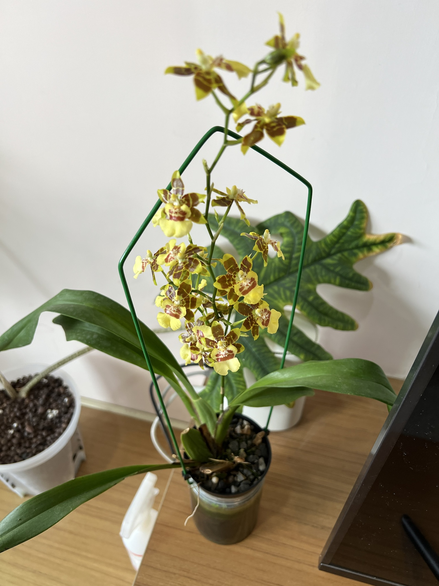

一年過去了，大家口中的「一次性花卉」文心蘭，不但沒被我養掛，還重新抽出花梗、開出跳舞的小黃裙。這篇記錄兩件事：一個看起來醜、卻救命的 DIY 小技巧，以及我這一年摸索出的懶人復花心法。

!!! abstract "速覽"
    - 關鍵動作：透明容器底部打洞，讓水能流動、帶入空氣。  
    - 光照判斷：長綠藻反而是「光線夠」的指標，太乾淨才值得警覺。  
    - 狀態檢查：盯緊假球莖的飽滿度，皺了就減水、泡了就加透氣。  

*▲ 罐子長滿綠藻，卻是光照充足、保水又透氣的證明。*

## 🛠️ 我的 DIY 秘密：透明罐底的一孔之見

剛買回來時，我用透明罐子套著植株，方便觀察根系。真正救命的，是底部那個我親手戳出的洞——讓多餘的水能排走，也讓每次澆水都像「淋浴」：水流經過根系、帶入新鮮空氣，避免變成悶死的水盆。

## 復花的三個關鍵觀察

### 1. 排水是活命的關鍵

蘭根需要呼吸。照片裡罐底有一層綠水，但因為底部有洞，水是流動的，不會悶住。每次澆水都是一次換氣，沒有這個洞，半年內就會爛根。

### 2. 綠藻是光照的「檢測劑」

- 長藻 = 光線足，才有機會分化花芽。  
- 如果瓶子乾乾淨淨、藻都不長，通常代表太陰暗，開不出花。  
- 藻類本身無害，但長太厚會搶養分，換盆時再刷乾淨就好。

### 3. 假球莖的飽滿度

根部上方像蒜頭的鼓起，就是假球莖。養了一年仍舊飽滿、不皺縮，代表根系吸水正常，澆水節奏（乾了再澆）也對了。

## 👨‍🌾 陽台族的懶人養護筆記

1. **不要怕醜**：透明容器＋底部打洞，比漂亮陶盆更容易看到問題。  
2. **忍住手**：介質變乾、根微微發白再澆，文心蘭比想像中耐渴。  
3. **耐心等待**：花謝就剪梗，專心養葉子與球莖。葉綠球飽，明年就會再跳舞。  

---

後記：這個「長藻罐」其實養出了時間感，也證明陽台光照夠。等這波花期結束，就幫它洗澡換新家，期待下一次更盛大的舞會。
