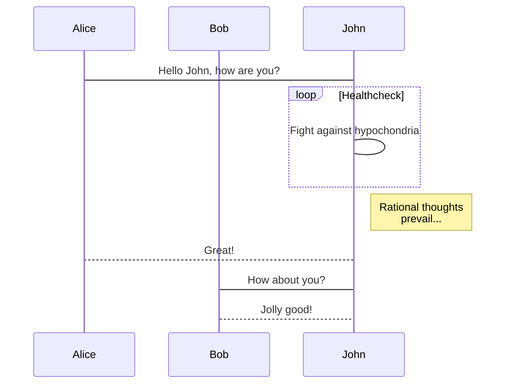

---
title: Markdown寫作應用推薦
tags:
  - Markdown
---  

<b>MWeb Pro </b>是一款適用於macOS的專業Markdown寫作、筆記本應用軟體。喜歡寫部落格的朋友，那你一定會需要 MWeb Pro 這款軟體。為您提供最佳的寫作體驗。

Markdown 語法支援：

使用 Github Flavored Markdown 語法，簡稱 GFM 語法。支援表格、TOC、LaTeX、程式碼塊、任務列表、腳註等。畫相簿支援 mermaid, viz, echarts, plantuml, sequence, flow。

輔助功能

支援截圖並貼上、複製並貼上、拖拽等方式插入圖片並直接顯示在編輯器內。在相容 Markdown 語法的情況下支援設定圖片寬度。好用的表格插入和 LaTeX 書寫輔助。

輸出功能

支援匯出為圖片、HTML、Epub、PDF、RTF、Docx。支援釋出到 Wordpress、印象筆記、Blogger、Medium、Tumblr等。支援七牛雲、又拍雲等以及自定義的圖床服務。

強大的筆記功能

強大的檔案庫支援分類樹和標籤管理檔案，檔案可歸類於多個分類，可以把分類整個匯出為 Epub、PDF 和生成靜態網站。非常合適用於筆記、個人知識收集、管理和輸出。 快速筆記：隨意增加筆記及圖片等素材，支援以天為單位把增加的素材組合在一個檔案內，方便整理及記錄歷史收集情況。快速搜尋：目前已支援全域性快捷鍵調出搜尋。

***
以下摘自MWeb關於Markdown的介紹

## 歡迎使用 MWeb

MWeb 是專業的 Markdown 寫作、記筆記、靜態部落格生成軟體，目前已支援 Mac，iPad 和 iPhone。MWeb 有以下特色：

## 軟體本身：

* 使用原生的 macOS 技術打造，追求與系統的完美結合。
* 原則上，首先是追求介面簡潔和高效能，然後才是強大易用，功能全面。

## Markdown 語法：

* 使用 GitHub Flavored Markdown 語法，簡稱 GFM 語法。
* 支援表格、TOC、LaTeX、程式碼塊、任務列表、腳註等。
* 畫相簿支援 mermaid, viz, ECharts, PlantUML, Sequence, Flow。

## Markdown 輔助：

* 支援截圖並貼上、複製並貼上、拖拽等方式插入圖片並直接顯示在編輯器內。
* 在相容 Markdown 語法的情況下支援設定圖片寬度。
* 好用的表格插入和 LaTeX 書寫輔助。

## Markdown 輸出：

* 支援匯出為圖片、HTML、Epub、PDF、RTF、Docx。
* 支援釋出到 WordPress、支援 Metaweblog API 協議的服務、Wordpress.com、印象筆記（Evernote）、Blogger、Medium、Tumblr、語雀、Ghost、少數派 Matrix。
* 圖片上傳服務（圖床）支援 Imgur、七牛雲、又拍雲、騰訊雲 COS、阿里雲 OSS、SM.MS和自定義的圖床服務。

## Markdown 筆記：

* 強大的檔案庫支援分類樹和標籤管理檔案，檔案可歸類於多個分類，可以把分類整個匯出為 Epub、PDF 和生成靜態網站。非常合適用於筆記、個人知識收集、管理和輸出。
* 快速筆記：隨意增加筆記及圖片等素材，支援以天為單位把增加的素材組合在一個檔案內，方便整理及記錄歷史收集情況。
* 快速搜尋：目前已支援全域性快捷鍵調出搜尋。

## 外部 Markdown 檔案：

* 外部 Markdown 檔案使用外部模式管理。外部模式使用目錄樹的方式編輯和管理你的 Markdown 檔案，還能很好的支援 GitBook、Jekyll、Hexo 等等編輯和圖片插入。

## MWeb 檔案：

如果要更詳細瞭解 MWeb，建議你一定要去看一下官網的幫助檔案，網址為：<https://zh.mweb.im/help.html>。我們建議在使用檔案庫之前，一定要閱讀一下 [MWeb 檔案庫詳細介紹](https://zh.mweb.im/mweb-library.html) 這篇文章，以便更好的使用檔案庫。

## 幫助我們改進 MWeb

如果你喜歡 MWeb，想讓它變得更好，你可以：

1. 推薦 MWeb，讓更多的人知道。
2. 給我們發反饋和建議：<coderforart+2333@gmail.com>
3. 在 Mac App Store 上評價 （如果是在 MAS 上購買的話）。


## GFM 語法簡介和 MWeb 所支援的擴充套件語法

### 回車轉為換行

官方的語法規定結尾加 2 個以上空格加換行才會轉成換行，也就是 `<br />` 標籤。MWeb 中有個選項可以直接把換行轉成 `<br />`，不用加上 2 個以上空格，這個選項預設是開啟的。如果要關閉，請在設定頁面關閉。

### 任務列表（Task lists）

Markdown 語法：

```
- [ ] 任務一 未做任務 `- + 空格 + [ ]`
- [x] 任務二 已做任務 `- + 空格 + [x]`
```

效果如下：

- [ ] 任務一 未做任務 `- + 空格 + [ ]`
- [x] 任務二 已做任務 `- + 空格 + [x]`

### 圖片大小及對齊

官方和 GFM 都不支援圖片大小設定，MWeb 引入的特別的語法來設定圖片寬度。如：`` 這樣表示設定圖片寬度為 450。其中 -w450 為設定語法，生成 HTML 時會自動移除。w 表示設定寬度。 可以看出，MWeb 引入的語法的特點是相容原來的語法和僅支援設定寬度。


### 多行或者一段程式碼

Markdown 語法：

	```js
	function fancyAlert(arg) {
	  if(arg) {
	    $.facebox({div:'#foo'})
	  }

	}
	```
	
效果如下：

```js
function fancyAlert(arg) {
	if(arg) {
		$.facebox({div:'#foo'})
	}

}
```

這個語法目前在 MWeb 中使用，必須前後空一行，才會正確解析。我覺得，在寫 Markdown 檔案過程中，運用空行很有必要，基本上，塊級元素（標題、列表、引用、程式碼塊、表格、段落等），都建議前後空一行。

### 表格

Markdown 語法：

```
第一格表頭 | 第二格表頭
--------- | -------------
內容單元格 第一列第一格 | 內容單元格第二列第一格
內容單元格 第一列第二格 多加文字 | 內容單元格第二列第二格
```

效果如下：

第一格表頭 | 第二格表頭
--------- | -------------
內容單元格 第一列第一格 | 內容單元格第二列第一格
內容單元格 第一列第二格 多加文字 | 內容單元格第二列第二格


### 刪除線

Markdown 語法：

	加刪除線像這樣用： ~~刪除這些~~

效果如下：

加刪除線像這樣用： ~~刪除這些~~

### LaTeX

Markdown 語法：

	塊級公式：
	```math
	x = \dfrac{-b \pm \sqrt{b^2 - 4ac}}{2a}
	```

	行內公式： ``\Gamma(n) = (n-1)!\quad\forall n\in\mathbb N``


效果如下（在設定頁面中啟用 LaTeX 才會看到效果）：

塊級公式：

```math
x = \dfrac{-b \pm \sqrt{b^2 - 4ac}}{2a}
```

行內公式： ``\Gamma(n) = (n-1)!\quad\forall n\in\mathbb N``

<!-- 注意：為了相容 MWeb 3，也支援 $\Gamma(n) = (n-1)!\quad\forall n\in\mathbb N$ 
和塊級語法
$$	x = \dfrac{-b \pm \sqrt{b^2 - 4ac}}{2a} $$
但是建議用新的語法。 -->

## MWeb 畫圖

### mermaid

mermaid 是比較流行的畫相簿，它支援流程圖、順序圖和甘特圖，它的官網為：<https://mermaidjs.github.io/> ，在 MWeb 中使用 mermaid 的語法就是宣告程式碼塊的語言為 mermaid，程式碼塊中再寫上 mermaid 的畫圖語法即可，你可以把下面的語法複製到 MWeb 中檢視效果。

    ```mermaid
    sequenceDiagram
        participant Alice
        participant Bob
        Alice->John: Hello John, how are you?
        loop Healthcheck
            John->John: Fight against hypochondria
        end
        Note right of John: Rational thoughts <br/>prevail...
        John-->Alice: Great!
        John->Bob: How about you?
        Bob-->John: Jolly good!
    ```
 
**效果如下：**
 

### echarts

echarts 是百度出品的 js 畫相簿，它的網址為：<https://echarts.apache.org/zh/index.html>，功能非常強大，MWeb 支援 echarts 的一些基本的用法，太高階的不支援。你可以將以下語法複製到 MWeb 中進行嘗試。你也可以去 <https://echarts.apache.org/examples/zh/index.html> 這個網址檢視一些例子，要注意的是 MWeb 只能解析 `option = {}` 這種簡單的，不過應該是足夠使用了。

    ```echarts
    option = {
        xAxis: {
            type: 'category',
            data: ['Mon', 'Tue', 'Wed', 'Thu', 'Fri', 'Sat', 'Sun']
        },
        yAxis: {
            type: 'value'
        },
        series: [{
            data: [820, 932, 901, 934, 1290, 1330, 1320],
            type: 'line'
        }]
    };
    ```

**效果如下：**

```echarts
option = {
    xAxis: {
        type: 'category',
        data: ['Mon', 'Tue', 'Wed', 'Thu', 'Fri', 'Sat', 'Sun']
    },
    yAxis: {
        type: 'value'
    },
    series: [{
        data: [820, 932, 901, 934, 1290, 1330, 1320],
        type: 'line'
    }]
};
```


### 腳註（Footnote）

Markdown 語法：

```
這是一個腳註：[^1]
```

效果如下：

這是一個腳註：[^1]

[^1]: 這裡是腳註資訊


### 註釋和閱讀更多

<!-- comment -->
<!-- more -->

**注** 閱讀更多的功能只用在檔案庫生成靜態網站或釋出到 Wordpress 部落格時，插入時注意要後空一行。


